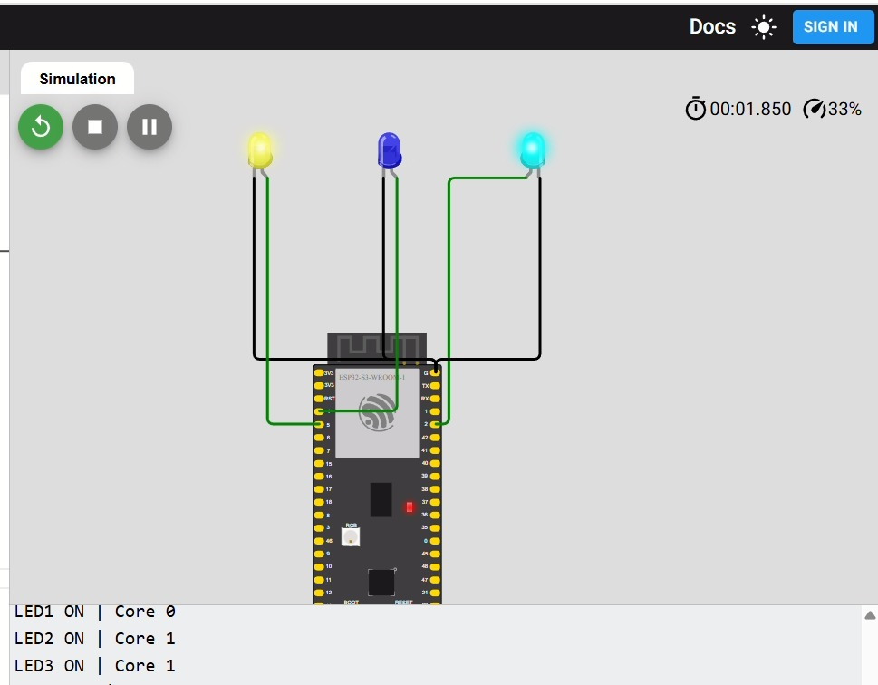
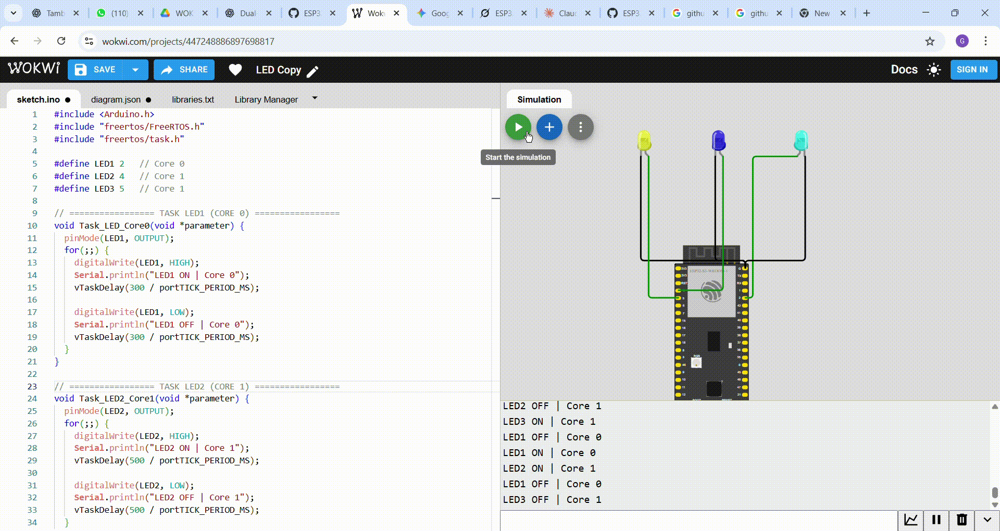

# 🔴🟢🔵 03 — Multi-Core LED Blinking with Serial Output (ESP32-S3)

## 📘 Deskripsi

Percobaan ini menampilkan implementasi LED multi-core pada ESP32-S3 menggunakan FreeRTOS tasks. Tujuan utama percobaan adalah menunjukkan bahwa beberapa task dapat berjalan paralel di core berbeda, dengan interval LED berbeda untuk memvisualisasikan eksekusi simultan.

- **LED1** dijalankan di **Core 0**
- **LED2** dan **LED3** dijalankan di **Core 1**
- Serial Monitor menampilkan status LED ON/OFF beserta core yang mengeksekusi task

## 🎯 Tujuan

- Memahami dual-core multitasking pada ESP32-S3
- Mengamati eksekusi task paralel pada core berbeda
- Memvisualisasikan interval berbeda LED untuk membuktikan simultanitas task

## ⚙️ Hardware Mapping

| Komponen | Pin    | Mode   | Core Eksekusi |
|----------|--------|--------|---------------|
| LED1     | GPIO 2 | Output | Core 0        |
| LED2     | GPIO 4 | Output | Core 1        |
| LED3     | GPIO 5 | Output | Core 1        |

## 🧠 Penjelasan Kode

Program ini menggunakan tiga task FreeRTOS, yaitu `Task_LED_Core0`, `Task_LED2_Core1`, dan `Task_LED3_Core1`. Setiap task mengendalikan satu LED dengan interval yang berbeda, dan berjalan pada core tertentu menggunakan `xTaskCreatePinnedToCore()`.

### Task LED1 (Core 0)

LED1 dikendalikan oleh Core 0. Task ini menyala selama 300 ms dan mati selama 300 ms. Serial Monitor menampilkan status ON/OFF beserta core.
```cpp
void Task_LED_Core0(void *parameter) {
  pinMode(LED1, OUTPUT);
  for(;;) {
    digitalWrite(LED1, HIGH);
    Serial.println("LED1 ON | Core 0");
    vTaskDelay(300 / portTICK_PERIOD_MS);

    digitalWrite(LED1, LOW);
    Serial.println("LED1 OFF | Core 0");
    vTaskDelay(300 / portTICK_PERIOD_MS);
  }
}
```

### Task LED2 (Core 1)

LED2 dikendalikan oleh Core 1. Interval LED berbeda dari LED1 untuk menunjukkan eksekusi paralel.
```cpp
void Task_LED2_Core1(void *parameter) {
  pinMode(LED2, OUTPUT);
  for(;;) {
    digitalWrite(LED2, HIGH);
    Serial.println("LED2 ON | Core 1");
    vTaskDelay(500 / portTICK_PERIOD_MS);

    digitalWrite(LED2, LOW);
    Serial.println("LED2 OFF | Core 1");
    vTaskDelay(500 / portTICK_PERIOD_MS);
  }
}
```

### Task LED3 (Core 1)

LED3 juga dijalankan di Core 1. Intervalnya berbeda dari LED2 untuk memvisualisasikan task paralel di core yang sama.
```cpp
void Task_LED3_Core1(void *parameter) {
  pinMode(LED3, OUTPUT);
  for(;;) {
    digitalWrite(LED3, HIGH);
    Serial.println("LED3 ON | Core 1");
    vTaskDelay(700 / portTICK_PERIOD_MS);

    digitalWrite(LED3, LOW);
    Serial.println("LED3 OFF | Core 1");
    vTaskDelay(700 / portTICK_PERIOD_MS);
  }
}
```

### Setup FreeRTOS Tasks

Pada `setup()`, Serial Monitor diinisialisasi, dan ketiga task dibuat menggunakan `xTaskCreatePinnedToCore()`.
```cpp
void setup() {
  Serial.begin(115200);
  delay(1000);
  Serial.println("Mulai program LED multi-core...");

  xTaskCreatePinnedToCore(Task_LED_Core0, "LED_Core0", 2048, NULL, 1, NULL, 0);
  xTaskCreatePinnedToCore(Task_LED2_Core1, "LED2_Core1", 2048, NULL, 1, NULL, 1);
  xTaskCreatePinnedToCore(Task_LED3_Core1, "LED3_Core1", 2048, NULL, 1, NULL, 1);
}

void loop() {
  // Kosong — seluruh logika dijalankan oleh FreeRTOS
}
```

## 🧪 Hasil Percobaan

- **LED1 (Core 0)**: ON/OFF setiap 300 ms
- **LED2 (Core 1)**: ON/OFF setiap 500 ms
- **LED3 (Core 1)**: ON/OFF setiap 700 ms
- Semua LED berjalan paralel, menampilkan log di Serial Monitor sesuai core masing-masing
- Pola LED konsisten tanpa saling memblokir

## 📸 FOTO



## 🎥 Video


---
