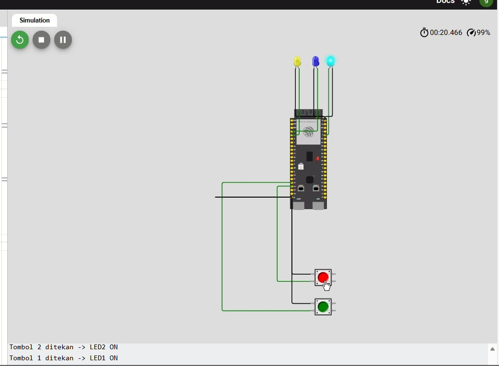

# 🔴🟢🔵 02 — Dual-Core Button Control (ESP32-S3)

## 📘 Deskripsi

Percobaan ini menampilkan implementasi **tombol multi-core** pada ESP32-S3 menggunakan **FreeRTOS tasks**. Tujuan utama percobaan adalah menunjukkan bahwa dua core dapat menjalankan **task independen** secara bersamaan, dengan masing-masing tombol mengendalikan LED berbeda tanpa blocking.

- **Tombol 1 (BTN1)** dikendalikan oleh task di Core 0 → menyalakan LED1 (kuning).
- **Tombol 2 (BTN2)** dikendalikan oleh task di Core 1 → menyalakan LED2 (biru).
- **LED3 (cyan)** berkedip di loop utama untuk menunjukkan bahwa loop utama tetap berjalan normal.

---

## 🎯 Tujuan

- Memahami **dual-core multitasking** pada ESP32-S3.
- Mengendalikan input (tombol) dan output (LED) secara paralel di core berbeda.
- Mengamati kestabilan task saat tombol ditekan bersamaan dengan loop utama.

---

## ⚙️ Hardware Mapping

| Komponen | Pin      | Mode          | Core Eksekusi |
|----------|----------|---------------|---------------|
| LED1     | GPIO 5   | Output        | Core 0        |
| LED2     | GPIO 4   | Output        | Core 1        |
| LED3     | GPIO 2   | Output        | Loop utama    |
| BTN1     | GPIO 12  | Input PULLUP  | Core 0        |
| BTN2     | GPIO 13  | Input PULLUP  | Core 1        |

---

## 🧠 Penjelasan Kode

Program ini menggunakan **dua task FreeRTOS**, yaitu `TaskTombol1` dan `TaskTombol2`. Masing-masing task bertanggung jawab membaca tombol tertentu dan mengendalikan LED terkait. Loop utama tetap aktif untuk mengedipkan LED3, menandakan microcontroller tetap responsif.

### Definisi Pin dan Task Handle

Di awal program, pin LED dan tombol didefinisikan, serta task handle disiapkan untuk keperluan referensi task.
```cpp
#define LED1 5
#define LED2 4
#define LED3 2
#define BTN1 12
#define BTN2 13

TaskHandle_t TaskButton1;
TaskHandle_t TaskButton2;
```

### Task Tombol 1 (Core 0)

Task ini membaca tombol hijau (`BTN1`). Jika tombol ditekan (`LOW`), maka LED1 menyala. Task berjalan di Core 0 dan menggunakan `vTaskDelay` untuk memberikan jeda polling tombol 50 ms.
```cpp
void TaskTombol1(void *pvParameters) {
  pinMode(BTN1, INPUT_PULLUP);
  pinMode(LED1, OUTPUT);

  Serial.printf("Task Tombol1 berjalan di core %d\n", xPortGetCoreID());

  while (true) {
    if (digitalRead(BTN1) == LOW) {
      digitalWrite(LED1, HIGH);
      Serial.println("Tombol 1 ditekan -> LED1 ON");
    } else {
      digitalWrite(LED1, LOW);
    }
    vTaskDelay(50 / portTICK_PERIOD_MS);
  }
}
```

### Task Tombol 2 (Core 1)

Task ini membaca tombol merah (`BTN2`). Jika tombol ditekan, maka LED2 menyala. Task berjalan di Core 1 dan polling tombol dengan interval 50 ms.
```cpp
void TaskTombol2(void *pvParameters) {
  pinMode(BTN2, INPUT_PULLUP);
  pinMode(LED2, OUTPUT);

  Serial.printf("Task Tombol2 berjalan di core %d\n", xPortGetCoreID());

  while (true) {
    if (digitalRead(BTN2) == LOW) {
      digitalWrite(LED2, HIGH);
      Serial.println("Tombol 2 ditekan -> LED2 ON");
    } else {
      digitalWrite(LED2, LOW);
    }
    vTaskDelay(50 / portTICK_PERIOD_MS);
  }
}
```

### Setup Task FreeRTOS dan Loop Utama

Pada fungsi `setup()`, komunikasi serial diinisialisasi. Task tombol dibuat dengan `xTaskCreatePinnedToCore()`. Loop utama tetap menjalankan LED3 berkedip setiap 500 ms untuk menunjukkan sistem tetap hidup.
```cpp
void setup() {
  Serial.begin(115200);
  delay(1000);
  Serial.println("=== Program Tombol Multi-Core dimulai ===");

  pinMode(LED3, OUTPUT);

  xTaskCreatePinnedToCore(TaskTombol1, "Tombol1", 2000, NULL, 1, &TaskButton1, 0);
  xTaskCreatePinnedToCore(TaskTombol2, "Tombol2", 2000, NULL, 1, &TaskButton2, 1);
}

void loop() {
  digitalWrite(LED3, HIGH);
  delay(500);
  digitalWrite(LED3, LOW);
  delay(500);
}
```

---

## 🧪 Hasil Percobaan

- **Menekan Tombol 1** → LED1 (kuning) menyala di Core 0.
- **Menekan Tombol 2** → LED2 (biru) menyala di Core 1.
- **LED3 (cyan)** berkedip setiap 500 ms di loop utama.
- Semua task berjalan simultan, membuktikan eksekusi paralel pada core berbeda.

---

## 📸 FOTO




---

## 🎥 Video


---

