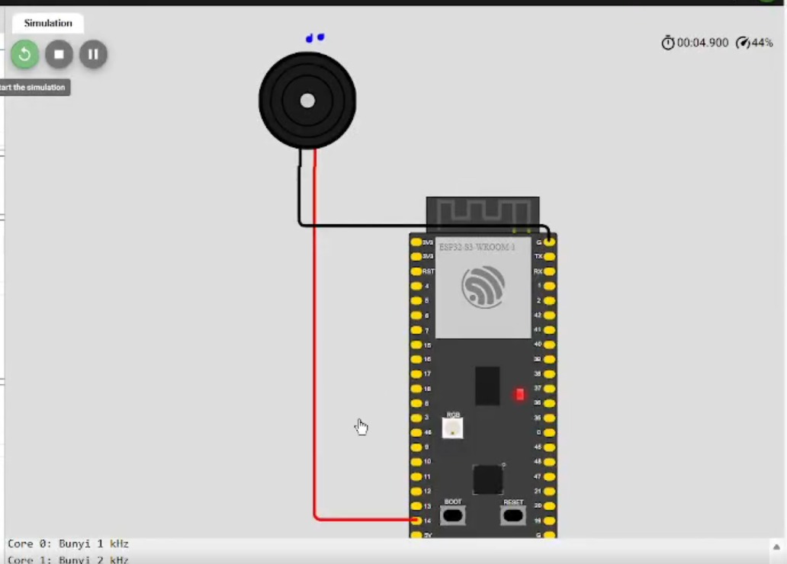

# 🔊 03 — Dual-Core Buzzer (ESP32-S3)

## 📘 Deskripsi

Percobaan ini menampilkan implementasi **buzzer multi-core** pada ESP32-S3 menggunakan **FreeRTOS tasks**.  
Tujuannya adalah menunjukkan bahwa dua core dapat menjalankan **task independen** secara bersamaan.

Buzzer akan menghasilkan dua nada berbeda:
- **Core 0** → 1 kHz  
- **Core 1** → 2 kHz  

Kedua nada berjalan **simultan** untuk membuktikan eksekusi paralel.

---

## 🎯 Tujuan

- Memahami **dual-core multitasking** pada ESP32-S3.  
- Membuktikan bahwa dua task berbeda dapat berjalan **simultan** pada core berbeda.  
- Mengamati kestabilan output buzzer saat task berjalan paralel.

---

## ⚙️ Hardware Mapping

| Komponen | Pin      | Mode   | Core Eksekusi   |
|----------|----------|--------|-----------------|
| Buzzer   | GPIO 14  | Output | Core 0 & Core 1 |

> **Catatan:** Buzzer yang sama digunakan di kedua core. Task di Core 0 menghasilkan nada 1 kHz, task di Core 1 menghasilkan nada 2 kHz.

---

## 🧠 Penjelasan Kode

Program ini menggunakan **dua task FreeRTOS**, yaitu `taskCore0` dan `taskCore1`. Masing-masing task bertanggung jawab menghasilkan nada dengan frekuensi berbeda pada buzzer yang sama, dan dijalankan di core tertentu menggunakan `xTaskCreatePinnedToCore()`.

### Definisi Pin dan Task Handle

Di awal program, pin buzzer didefinisikan dan task handle disiapkan untuk keperluan referensi task.
```cpp
#include <Arduino.h>

#define BUZZER_PIN 14

TaskHandle_t TaskCore0;
TaskHandle_t TaskCore1;
```

### Task Core 0

Task di Core 0 menghasilkan nada **1 kHz** setiap 500 ms. Task ini menggunakan fungsi `tone()` untuk menghasilkan sinyal PWM pada buzzer, kemudian `noTone()` untuk mematikan suara.
```cpp
void taskCore0(void *pvParameters) {
  while (true) {
    tone(BUZZER_PIN, 1000);   // 1 kHz
    Serial.println("Core 0: Bunyi 1 kHz");
    delay(500);
    noTone(BUZZER_PIN);
    delay(500);
  }
}
```

### Task Core 1

Task di Core 1 menghasilkan nada **2 kHz** setiap 300 ms. Interval yang berbeda dari Core 0 membuktikan bahwa kedua task berjalan secara independen dan paralel.
```cpp
void taskCore1(void *pvParameters) {
  while (true) {
    tone(BUZZER_PIN, 2000);   // 2 kHz
    Serial.println("Core 1: Bunyi 2 kHz");
    delay(300);
    noTone(BUZZER_PIN);
    delay(300);
  }
}
```

### Setup FreeRTOS

Di fungsi `setup()`, serial monitor diinisialisasi dan kedua task dibuat serta dipetakan ke core tertentu menggunakan `xTaskCreatePinnedToCore()`.
```cpp
void setup() {
  Serial.begin(115200);
  pinMode(BUZZER_PIN, OUTPUT);
  
  Serial.println("=== Program Buzzer Multi-Core dimulai ===");
  
  xTaskCreatePinnedToCore(taskCore0, "TaskCore0", 2048, NULL, 1, &TaskCore0, 0);
  xTaskCreatePinnedToCore(taskCore1, "TaskCore1", 2048, NULL, 1, &TaskCore1, 1);
}
```

### Loop Utama

Fungsi `loop()` sengaja dikosongkan karena semua logika eksekusi buzzer dijalankan oleh task FreeRTOS.
```cpp
void loop() {
  // Kosong — semua tugas dijalankan oleh dua core
}
```

---

## 🧪 Hasil Percobaan

- **Core 0** menghasilkan bunyi 1 kHz setiap 500 ms.
- **Core 1** menghasilkan bunyi 2 kHz setiap 300 ms.
- Kedua nada terdengar simultan, membuktikan task berjalan paralel di dua core.
- Serial Monitor menampilkan log dari kedua core secara bergantian, menunjukkan eksekusi paralel yang aktif.

---

## 📸 FOTO


---

## 🎥 Video


---
