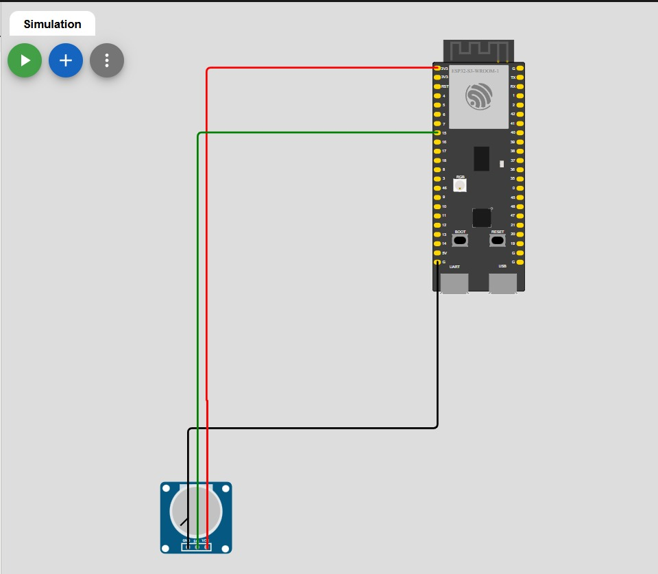

# 🎛️ 04 — Dual-Core Potensiometer (ESP32-S3)

## 📘 Deskripsi

Percobaan ini menampilkan implementasi **dual-core ESP32-S3** untuk membaca dan menampilkan nilai potensiometer menggunakan **FreeRTOS tasks**.

Tujuan percobaan adalah menunjukkan bahwa dua core dapat menjalankan **task independen** secara bersamaan tanpa blocking.

- **Core 0:** membaca nilai potensiometer
- **Core 1:** menampilkan nilai potensiometer terakhir ke Serial Monitor

## 🎯 Tujuan

- Memahami **dual-core multitasking** pada ESP32-S3
- Membaca nilai sensor analog secara kontinu di satu core dan menampilkannya di core lain
- Memahami penggunaan **variabel global volatile** untuk komunikasi antar-core

## ⚙️ Hardware Mapping

| Komponen       | Pin     | Mode   | Core Eksekusi    |
|----------------|---------|--------|------------------|
| Potensiometer  | GPIO 15 | Input  | Core 0 (baca)    |
| Serial Monitor | -       | Output | Core 1 (tampil)  |

> **Catatan:** Nilai potensiometer dibaca di Core 0 dan dikirim melalui variabel global `potValue` ke Core 1.

## 🧠 Penjelasan Kode

### 🔹 Definisi Pin dan Task Handle
```cpp
#include <Arduino.h>

#define POT_PIN 15  // sesuai wiring

TaskHandle_t TaskCore0;
TaskHandle_t TaskCore1;

volatile int potValue = 0;  // variabel global berbagi antar-core
```

### 🔹 Task Core 0: Baca Potensiometer

Task ini membaca nilai analog dari potensiometer setiap 100 ms dan menyimpannya ke variabel global.
```cpp
void taskCore0(void *pvParameters) {
  for (;;) {
    int val = analogRead(POT_PIN);  // baca nilai analog 0–4095
    potValue = val;                 // simpan ke variabel global
    
    // Log untuk Core 0
    Serial.print("Core 0: Membaca potensiometer = ");
    Serial.println(val);
    
    vTaskDelay(100 / portTICK_PERIOD_MS);  // sampling tiap 100 ms
  }
}
```

### 🔹 Task Core 1: Tampilkan ke Serial

Task ini menampilkan nilai potensiometer terakhir ke Serial Monitor setiap 300 ms.
```cpp
void taskCore1(void *pvParameters) {
  for (;;) {
    Serial.print("Core 1: Nilai pot terakhir = ");
    Serial.println(potValue);
    
    vTaskDelay(300 / portTICK_PERIOD_MS);  // tampilkan tiap 300 ms
  }
}
```

### 🔹 Setup FreeRTOS

Di fungsi `setup()`, serial monitor diinisialisasi, pin potensiometer disiapkan, dan task dipetakan ke core tertentu.
```cpp
void setup() {
  Serial.begin(115200);
  delay(1000);
  Serial.println("=== Program Dual-Core Potensiometer ===");
  
  pinMode(POT_PIN, INPUT);
  
  // Task pembaca (Core 0)
  xTaskCreatePinnedToCore(taskCore0, "TaskCore0", 2048, NULL, 1, &TaskCore0, 0);
  
  // Task penampil (Core 1)
  xTaskCreatePinnedToCore(taskCore1, "TaskCore1", 2048, NULL, 1, &TaskCore1, 1);
}

void loop() {
  // Kosong, semua kerja di task FreeRTOS
}
```

## 🧪 Hasil Percobaan

- **Core 0** membaca nilai potensiometer setiap 100 ms
- **Core 1** menampilkan nilai terakhir ke Serial Monitor setiap 300 ms
- Dua task berjalan paralel tanpa mengganggu satu sama lain
- Nilai potensiometer berkisar antara 0-4095 (12-bit ADC)

## 📸 FOTO


## 🎥 Video


---

