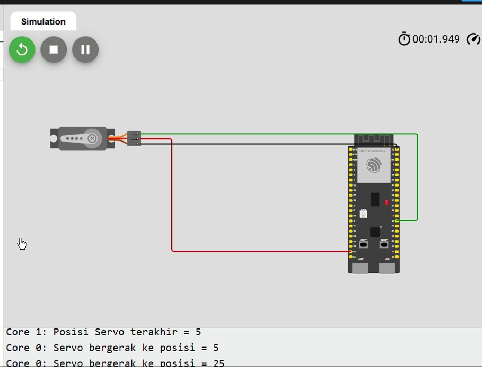

# 🤖⚙️ 05 — Dual-Core Servo Control (ESP32-S3)

## 📘 Deskripsi

Percobaan ini menampilkan implementasi kontrol servo menggunakan dual-core pada ESP32-S3 dengan FreeRTOS tasks.

- **Core 0** bertugas menggerakkan servo secara kontinu dari 0° hingga 180° dan kembali ke 0°
- **Core 1** bertugas menampilkan posisi servo terakhir di Serial Monitor

Program ini membuktikan bahwa dua core dapat menjalankan task berbeda secara paralel: satu untuk eksekusi hardware (servo) dan satu untuk monitoring (serial logging).

## 🎯 Tujuan

- Memahami implementasi dual-core multitasking dengan FreeRTOS pada ESP32-S3
- Mengendalikan perangkat hardware (servo) di satu core, sambil tetap memonitor posisinya dari core lain
- Memvisualisasikan kerja paralel antar-core melalui Serial Monitor

## ⚙️ Hardware Mapping

| Komponen | Pin     | Mode   | Core Eksekusi |
|----------|---------|--------|---------------|
| Servo    | GPIO 45 | Output | Core 0        |

## 🧠 Penjelasan Kode

Program ini menggunakan dua task FreeRTOS:
- `taskCore0` → gerakkan servo (Core 0)
- `taskCore1` → tampilkan posisi servo (Core 1)

Variabel `servoPos` bersifat `volatile` agar bisa diakses secara aman antar-core. Variabel `arahNaik` menentukan arah gerakan servo.

### 🔹 Definisi Library dan Variabel Global
```cpp
#include <Arduino.h>
#include <ESP32Servo.h>

#define SERVO_PIN 45

Servo myServo;
TaskHandle_t TaskCore0;
TaskHandle_t TaskCore1;

volatile int servoPos = 0;    // posisi servo saat ini
bool arahNaik = true;         // arah gerakan servo
```

### 🔹 Task Core 0 — Gerakkan Servo

Task ini menggerakkan servo dari 0° → 180° dan kembali ke 0°, dengan step 5°. Posisi servo diupdate setiap 50 ms. Serial print dibatasi agar tidak terlalu sering, cukup setiap 200 ms.
```cpp
void taskCore0(void *pvParameters) {
  myServo.attach(SERVO_PIN);
  myServo.write(0);
  
  for (;;) {
    if (arahNaik) {
      servoPos += 5;
      if (servoPos >= 180) arahNaik = false;
    } else {
      servoPos -= 5;
      if (servoPos <= 0) arahNaik = true;
    }

    myServo.write(servoPos);

    static unsigned long lastPrint = 0;
    if (millis() - lastPrint > 200) {
      Serial.print("Core 0: Servo bergerak ke posisi = ");
      Serial.println(servoPos);
      lastPrint = millis();
    }

    vTaskDelay(50 / portTICK_PERIOD_MS);
  }
}
```

### 🔹 Task Core 1 — Tampilkan Posisi Servo

Task ini berjalan di Core 1 dan menampilkan posisi servo terakhir setiap 300 ms. Ini membuktikan bahwa monitoring task bisa berjalan paralel tanpa mengganggu gerakan servo.
```cpp
void taskCore1(void *pvParameters) {
  for (;;) {
    Serial.print("Core 1: Posisi Servo terakhir = ");
    Serial.println(servoPos);
    vTaskDelay(300 / portTICK_PERIOD_MS);
  }
}
```

### 🔹 Setup FreeRTOS Tasks

Di fungsi `setup()`, Serial Monitor diinisialisasi dan kedua task dibuat dengan `xTaskCreatePinnedToCore()`. Core 0 menangani gerakan servo, Core 1 menangani monitoring.
```cpp
void setup() {
  Serial.begin(115200);
  delay(1000);
  Serial.println("=== Program Servo Dual-Core ===");

  xTaskCreatePinnedToCore(taskCore0, "TaskCore0", 4096, NULL, 1, &TaskCore0, 0);
  xTaskCreatePinnedToCore(taskCore1, "TaskCore1", 2048, NULL, 1, &TaskCore1, 1);
}

void loop() {
  // Kosong, semua kerja di task FreeRTOS
}
```

## 🧪 Hasil Percobaan

- **Core 0:** Servo bergerak bolak-balik dari 0° → 180° dan kembali ke 0° secara kontinu
- **Core 1:** Serial Monitor menampilkan posisi servo terakhir setiap 300 ms
- Kedua task berjalan paralel tanpa saling memblokir, membuktikan dual-core multitasking

### Contoh Output di Serial Monitor
```
Core 0: Servo bergerak ke posisi = 5
Core 1: Posisi Servo terakhir = 5
Core 0: Servo bergerak ke posisi = 10
Core 1: Posisi Servo terakhir = 10
Core 0: Servo bergerak ke posisi = 15
Core 1: Posisi Servo terakhir = 15
...
```

## 📸 FOTO



## 🎥 Bukti Video


---
