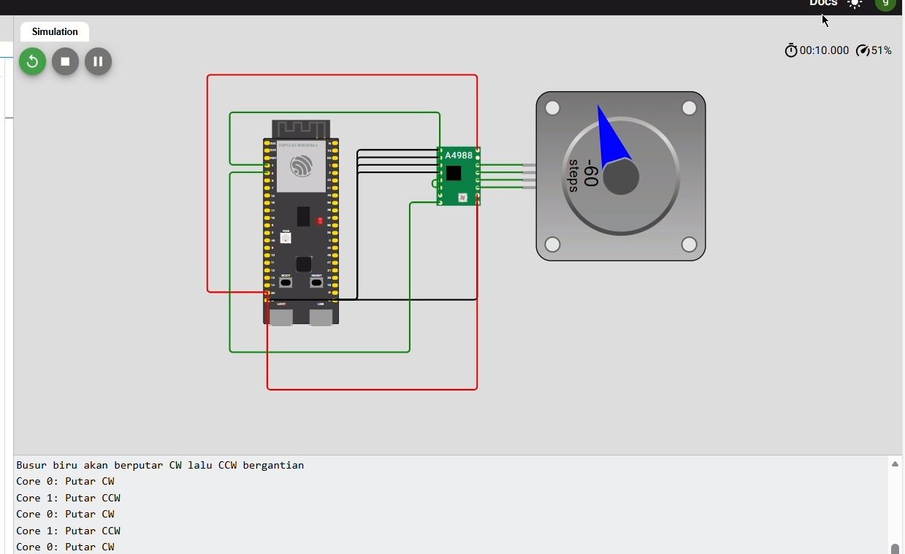

# 🌀 Percobaan 06 — Dual-Core Stepper Motor Control

> **ESP32-S3 Multitasking dengan FreeRTOS**

---

## 📘 Deskripsi

Percobaan ini menampilkan implementasi **dual-core control** untuk stepper motor menggunakan **ESP32-S3** dan **FreeRTOS**. 

- ⚙️ **Core 0** bertugas memutar motor searah jarum jam (**CW**)
- ⚙️ **Core 1** bertugas memutar motor berlawanan arah jarum jam (**CCW**)
- 📊 **Serial Monitor** menampilkan log core dan arah putaran

Program ini membuktikan bahwa dua core dapat menjalankan task berbeda secara **paralel**, sehingga motor dapat diputar bergantian dengan task monitoring/logging yang bersih.

---

## 🎯 Tujuan

✅ Memahami **dual-core multitasking** pada ESP32-S3  
✅ Mengendalikan stepper motor dengan task terpisah untuk arah **CW** dan **CCW**  
✅ Mengamati eksekusi **paralel** dan log serial dari masing-masing core

---

## ⚙️ Hardware Mapping

| Komponen        | Pin    | Mode   | Core Eksekusi              |
|-----------------|--------|--------|----------------------------|
| Stepper STEP    | GPIO 4 | Output | Core 0 / Core 1 (bergantian) |
| Stepper DIR     | GPIO 5 | Output | Core 0 / Core 1            |
| Stepper ENABLE  | GPIO 2 | Output | Shared                     |

> **Catatan:** `ENABLE_PIN` selalu aktif (**LOW**) agar motor siap bergerak.

---

## 🧠 Penjelasan Kode

Program ini menggunakan dua task **FreeRTOS**, satu di **Core 0** dan satu di **Core 1**:

- `Task1` → memutar motor **CW** (Core 0)
- `Task2` → memutar motor **CCW** (Core 1)

### 🔄 Task Core 0 — Putar CW

Task ini memutar stepper motor **searah jarum jam**. Setiap langkah dilakukan dengan `delayMicroseconds(stepDelay)` agar animasi terlihat di simulator (Wokwi).
```cpp
void Task1(void *pvParameters) {
  for (;;) {
    digitalWrite(ENABLE_PIN, LOW);
    digitalWrite(DIR_PIN, HIGH);  // CW
    
    Serial.print("Core ");
    Serial.print(xPortGetCoreID());
    Serial.println(": Putar CW");
    
    for (int i = 0; i < stepsPerRevolution; i++) {
      digitalWrite(STEP_PIN, HIGH);
      delayMicroseconds(stepDelay);
      digitalWrite(STEP_PIN, LOW);
      delayMicroseconds(stepDelay);
    }
    
    delay(1000); // jeda sebelum giliran berikutnya
  }
}
```

---

### 🔁 Task Core 1 — Putar CCW

Task ini memutar motor **berlawanan arah jarum jam** (CCW), berjalan paralel di **Core 1**.
```cpp
void Task2(void *pvParameters) {
  for (;;) {
    digitalWrite(ENABLE_PIN, LOW);
    digitalWrite(DIR_PIN, LOW);  // CCW
    
    Serial.print("Core ");
    Serial.print(xPortGetCoreID());
    Serial.println(": Putar CCW");
    
    for (int i = 0; i < stepsPerRevolution; i++) {
      digitalWrite(STEP_PIN, HIGH);
      delayMicroseconds(stepDelay);
      digitalWrite(STEP_PIN, LOW);
      delayMicroseconds(stepDelay);
    }
    
    delay(1000); // jeda sebelum giliran berikutnya
  }
}
```

---

### 🚀 Setup FreeRTOS Tasks

Pada `setup()`, **Serial Monitor** diinisialisasi, pin-pin stepper diatur sebagai output, dan kedua task dibuat dengan `xTaskCreatePinnedToCore()` di **Core 0** dan **Core 1**.
```cpp
void setup() {
  Serial.begin(115200);
  pinMode(STEP_PIN, OUTPUT);
  pinMode(DIR_PIN, OUTPUT);
  pinMode(ENABLE_PIN, OUTPUT);
  digitalWrite(ENABLE_PIN, LOW);
  
  Serial.println("=== Stepper ESP32-S3 Wokwi ===");
  Serial.println("Busur biru akan berputar CW lalu CCW bergantian");
  
  xTaskCreatePinnedToCore(Task1, "TaskCore0", 10000, NULL, 1, &TaskCore0, 0);
  delay(500);
  xTaskCreatePinnedToCore(Task2, "TaskCore1", 10000, NULL, 1, &TaskCore1, 1);
}

void loop() {
  // Kosong, semua dijalankan oleh task
}
```

---

## 🧪 Hasil Percobaan

- ✅ **Core 0:** Stepper motor berputar **CW** setiap 200 langkah (1 putaran)
- ✅ **Core 1:** Stepper motor berputar **CCW** setiap 200 langkah
- 📊 **Serial Monitor** menampilkan log core dan arah putaran:
```
Core 0: Putar CW
Core 1: Putar CCW
Core 0: Putar CW
Core 1: Putar CCW
...
```

- 🔄 Kedua task berjalan **paralel**, motor bergantian bergerak tanpa saling memblokir

---

## 📸 FOTO

---

## 🎥 Video 


---

