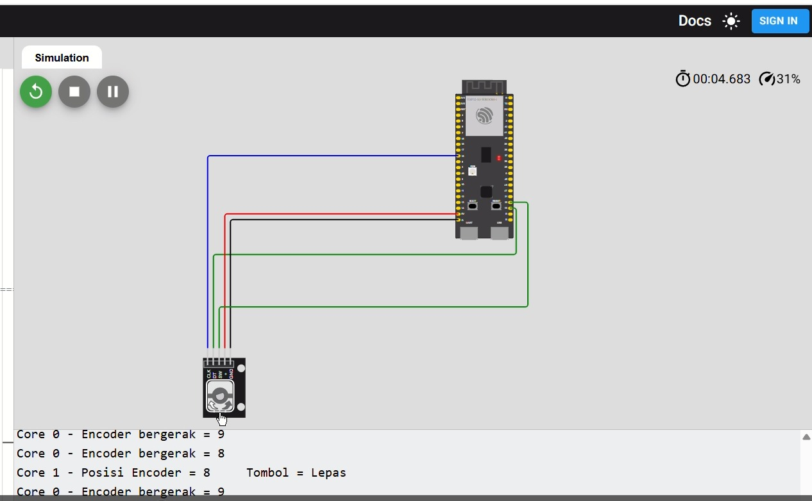

# 🔄 07 — Dual-Core Rotary Encoder Monitoring (ESP32-S3)

<div align="center">


</div>

---

## 📘 Deskripsi

Percobaan ini menampilkan implementasi **dual-core monitoring** rotary encoder pada ESP32-S3 menggunakan **FreeRTOS**.

- **Core 0** bertugas membaca pulsa rotary encoder (CLK & DT) dan tombol tekan (SW)
- **Core 1** bertugas menampilkan posisi encoder dan status tombol secara periodik di Serial Monitor

Program ini membuktikan bahwa dua core dapat menjalankan task input dan monitoring secara **paralel** tanpa saling memblokir.

---

## 🎯 Tujuan

✅ Memahami **dual-core multitasking** pada ESP32-S3  
✅ Membaca input rotary encoder di satu core, sambil menampilkan data di core lain  
✅ Mengamati posisi encoder dan status tombol secara **real-time** di Serial Monitor

---

## ⚙️ Hardware Mapping

| Komponen    | Pin      | Mode          | Core Eksekusi |
|-------------|----------|---------------|---------------|
| Encoder CLK | GPIO 18  | Input         | Core 0        |
| Encoder DT  | GPIO 19  | Input         | Core 0        |
| Encoder SW  | GPIO 20  | Input PULLUP  | Core 0        |

---

## 🧠 Penjelasan Kode

Program ini menggunakan dua task FreeRTOS:

- `taskCore0` → membaca rotary encoder & tombol **(Core 0)**
- `taskCore1` → menampilkan posisi encoder & status tombol **(Core 1)**

Variabel `encoderValue` dan `buttonPressed` bersifat `volatile` agar bisa diakses secara aman antar-core.

---

### 📍 Task Core 0 — Baca Encoder dan Tombol

Task ini memonitor perubahan pulsa **CLK** dan arah putar dari **DT**. Selain itu, juga mendeteksi tombol ditekan/dilepas. Log Serial dicetak saat terjadi perubahan.
```cpp
void taskCore0(void *pvParameters) {
  pinMode(CLK, INPUT);
  pinMode(DT, INPUT);
  pinMode(SW, INPUT_PULLUP);

  for (;;) {
    int currentStateCLK = digitalRead(CLK);
    int currentStateDT  = digitalRead(DT);

    if (currentStateCLK != lastStateCLK) {
      if (currentStateDT != currentStateCLK) encoderValue++;
      else encoderValue--;

      Serial.print("Core 0 - Encoder bergerak = ");
      Serial.println(encoderValue);
    }
    lastStateCLK = currentStateCLK;

    if (digitalRead(SW) == LOW) {
      if (!buttonPressed) {
        buttonPressed = true;
        Serial.println("Core 0 - Tombol ditekan");
      }
    } else {
      if (buttonPressed) {
        buttonPressed = false;
        Serial.println("Core 0 - Tombol dilepas");
      }
    }

    vTaskDelay(2 / portTICK_PERIOD_MS);
  }
}
```

---

### 📍 Task Core 1 — Tampilkan Posisi Encoder

Task ini berjalan di **Core 1** dan menampilkan posisi encoder serta status tombol setiap **200 ms**.
```cpp
void taskCore1(void *pvParameters) {
  for (;;) {
    Serial.print("Core 1 - Posisi Encoder = ");
    Serial.print(encoderValue);
    Serial.print("\tTombol = ");
    Serial.println(buttonPressed ? "Ditekan" : "Lepas");

    vTaskDelay(200 / portTICK_PERIOD_MS);
  }
}
```

---

### 🔧 Setup FreeRTOS Tasks

Di fungsi `setup()`, Serial Monitor diinisialisasi dan kedua task dibuat menggunakan `xTaskCreatePinnedToCore()`.
```cpp
void setup() {
  Serial.begin(115200);
  delay(1000);
  Serial.println("=== Program Encoder Dual-Core ===");

  xTaskCreatePinnedToCore(taskCore0, "TaskCore0", 2048, NULL, 1, &TaskCore0, 0);
  xTaskCreatePinnedToCore(taskCore1, "TaskCore1", 2048, NULL, 1, &TaskCore1, 1);
}

void loop() {
  // Kosong, semua kerja di task FreeRTOS
}
```

---

## 🧪 Hasil Percobaan

✔️ **Core 0**: Membaca perubahan rotary encoder dan tombol dengan respons cepat  
✔️ **Core 1**: Menampilkan posisi encoder dan status tombol setiap 200 ms  
✔️ **Kedua task** berjalan paralel, menampilkan data real-time tanpa blocking

### 📟 Contoh Output Serial Monitor
```
Core 0 - Encoder bergerak = 1
Core 1 - Posisi Encoder = 1	Tombol = Lepas
Core 0 - Encoder bergerak = 2
Core 0 - Tombol ditekan
Core 1 - Posisi Encoder = 2	Tombol = Ditekan
...
```

---

## 📸 FOTO

---

## 🎥 Video
![[Watch Demo]](../assets/RotaryEncoder.gif)

---
