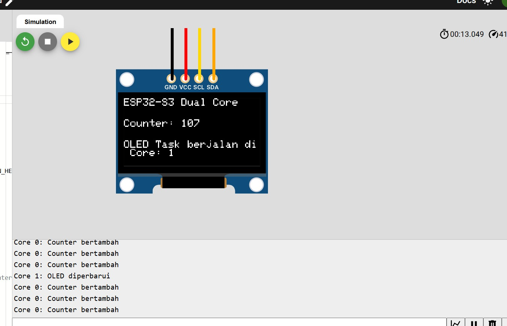

# 🖥️ 07 — Dual-Core OLED Counter (ESP32-S3)

<div align="center">


</div>

---

## 📘 Deskripsi

Percobaan ini menampilkan implementasi **dual-core display counter** menggunakan ESP32-S3, **FreeRTOS**, dan **OLED SSD1306**.

- **Core 0** bertugas menghitung counter secara terus-menerus setiap 100 ms
- **Core 1** bertugas menampilkan counter ke OLED setiap 1 detik
- Akses **I2C** dilindungi oleh **mutex** agar kedua core tidak saling konflik saat mengakses display

Program ini membuktikan bahwa dua core dapat menjalankan task berbeda secara **paralel**, dengan satu core menangani perhitungan dan core lain menangani output visual.

---

## 🎯 Tujuan

✅ Memahami implementasi **dual-core multitasking** dengan FreeRTOS pada ESP32-S3  
✅ Menampilkan data **real-time** pada OLED melalui task terpisah  
✅ Menggunakan **mutex** untuk mengamankan akses perangkat I2C

---

## ⚙️ Hardware Mapping

| Komponen  | Pin     | Mode | Core Eksekusi      |
|-----------|---------|------|--------------------|
| OLED SDA  | GPIO 8  | I2C  | Core 1 (display)   |
| OLED SCL  | GPIO 9  | I2C  | Core 1 (display)   |

> **Catatan:** Core 0 hanya menghitung counter, tidak langsung mengakses OLED.

---

## 🧠 Penjelasan Kode

Program ini menggunakan dua task FreeRTOS:

- `taskCore0` → menghitung counter **(Core 0)**
- `taskCore1` → menampilkan counter ke OLED **(Core 1)**

Variabel `counter` bersifat `volatile` agar aman diakses antar-core. **Mutex** `i2cMutex` mencegah konflik I2C saat Core 1 menulis ke OLED.

---

### 📊 Task Core 0 — Hitung Counter

Task ini menambahkan nilai `counter` setiap **100 ms** dan menampilkan log di Serial Monitor.
```cpp
void taskCore0(void *pvParameters) {
  String coreID = String(xPortGetCoreID());
  for (;;) {
    counter++;
    Serial.print("Core ");
    Serial.print(coreID);
    Serial.println(": Counter bertambah");

    vTaskDelay(100 / portTICK_PERIOD_MS);
  }
}
```

---

### 📺 Task Core 1 — Tampilkan Counter di OLED

Task ini menampilkan nilai counter di OLED setiap **1 detik**. Sebelum mengakses I2C, task mengambil **mutex** untuk menghindari konflik. Setelah selesai, mutex dilepas.
```cpp
void taskCore1(void *pvParameters) {
  String coreID = String(xPortGetCoreID());
  for (;;) {
    if (xSemaphoreTake(i2cMutex, portMAX_DELAY) == pdTRUE) {
      display.clearDisplay();
      display.setTextSize(1);
      display.setTextColor(SSD1306_WHITE);

      display.setCursor(0, 0);
      display.println("ESP32-S3 Dual Core");

      display.setCursor(0, 20);
      display.print("Counter: ");
      display.println(counter);

      display.setCursor(0, 40);
      display.print("OLED Task berjalan di Core: ");
      display.println(coreID);

      display.display();
      xSemaphoreGive(i2cMutex);
    }

    Serial.print("Core ");
    Serial.print(coreID);
    Serial.println(": OLED diperbarui");

    vTaskDelay(1000 / portTICK_PERIOD_MS);
  }
}
```

---

### 🔧 Setup FreeRTOS Tasks

Di fungsi `setup()`, Serial Monitor diinisialisasi, OLED diinisialisasi, **mutex** dibuat, dan kedua task dijalankan di core masing-masing.
```cpp
void setup() {
  Serial.begin(115200);
  delay(1000);

  Wire.begin(SDA_PIN, SCL_PIN);
  i2cMutex = xSemaphoreCreateMutex();

  if (!display.begin(SSD1306_SWITCHCAPVCC, 0x3C)) {
    Serial.println("Gagal inisialisasi OLED!");
    while (true);
  }

  xTaskCreatePinnedToCore(taskCore0, "TaskCore0", 2048, NULL, 1, &TaskCore0, 0);
  xTaskCreatePinnedToCore(taskCore1, "TaskCore1", 4096, NULL, 1, &TaskCore1, 1);
}

void loop() {
  // Kosong, semua kerja di task
}
```

---

## 🧪 Hasil Percobaan

✔️ **Core 0**: Counter bertambah setiap 100 ms  
✔️ **Core 1**: OLED menampilkan nilai counter setiap 1 detik, dan Serial Monitor menampilkan log pembaruan  
✔️ **Kedua core** bekerja paralel, tidak saling memblokir, dan akses I2C aman berkat **mutex**

### 📟 Contoh Output Serial Monitor
```
Core 0: Counter bertambah
Core 0: Counter bertambah
Core 1: OLED diperbarui
Core 0: Counter bertambah
Core 0: Counter bertambah
Core 0: Counter bertambah
Core 0: Counter bertambah
Core 0: Counter bertambah
Core 0: Counter bertambah
Core 0: Counter bertambah
Core 0: Counter bertambah
Core 0: Counter bertambah
Core 0: Counter bertambah
Core 1: OLED diperbarui
...
```

---

## 🔒 Mutex Protection

**Mengapa Mutex Diperlukan?**

- I2C adalah bus komunikasi yang **tidak thread-safe**
- Tanpa mutex, kedua core bisa mengakses I2C secara bersamaan
- Hasilnya: **data corruption** dan **display glitch**

**Cara Kerja Mutex:**
```cpp
// Core 1 mengambil mutex sebelum akses I2C
xSemaphoreTake(i2cMutex, portMAX_DELAY);

// Akses I2C aman di sini
display.display();

// Lepas mutex setelah selesai
xSemaphoreGive(i2cMutex);
```

---

## 📸 Visual


---

## 🎥 Video
![[Watch Demo]](../assets/OLED.gif)

---

## 📚 Library yang Digunakan
```cpp
#include <Wire.h>
#include <Adafruit_GFX.h>
#include <Adafruit_SSD1306.h>
```

**Instalasi Library:**

1. Buka Arduino IDE
2. Tools → Manage Libraries
3. Cari dan install:
   - `Adafruit GFX Library`
   - `Adafruit SSD1306`

---

## 🔍 Konsep Penting

### 🔄 Dual-Core Architecture
```
┌─────────────────┐         ┌─────────────────┐
│    CORE 0       │         │    CORE 1       │
│                 │         │                 │
│  ⚙️ Counter++   │         │  🖥️ OLED Update │
│  (100ms)        │         │  (1000ms)       │
│                 │         │                 │
└────────┬────────┘         └────────┬────────┘
         │                           │
         └───────────┬───────────────┘
                     │
              🔒 Mutex Lock
                     │
              ┌──────▼──────┐
              │   I2C Bus   │
              │  (OLED)     │
              └─────────────┘
```

### 📊 Task Priority

| Task       | Core | Priority | Stack Size | Interval |
|------------|------|----------|------------|----------|
| taskCore0  | 0    | 1        | 2048 bytes | 100 ms   |
| taskCore1  | 1    | 1        | 4096 bytes | 1000 ms  |

---
